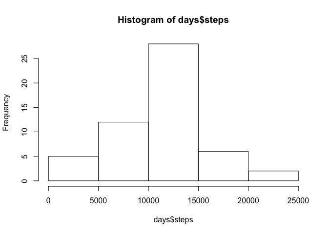
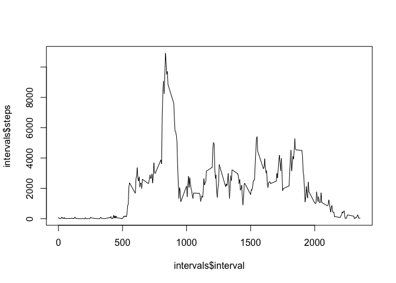
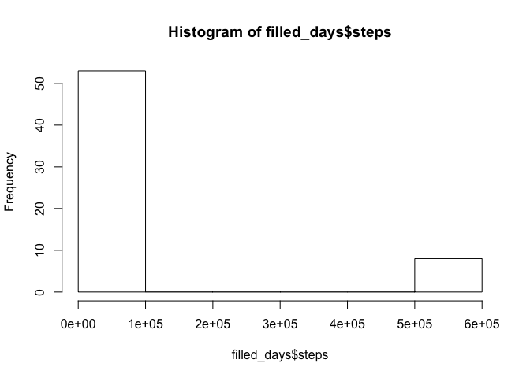
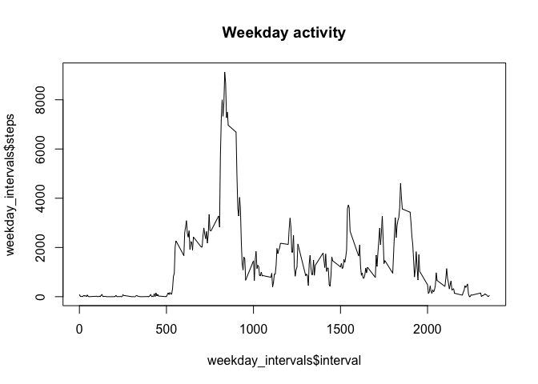
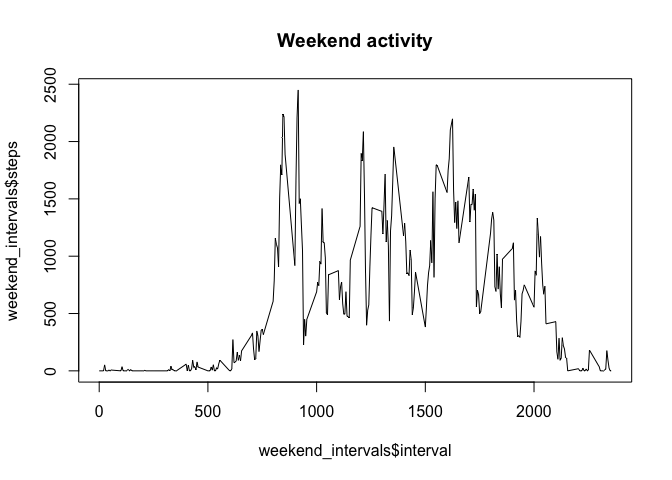

# Reproducible Research: Peer Assessment 1
Adam Wiggins  
August 15, 2015  

_This is homework assignment 1 for the [Reproducible Research course](https://www.coursera.org/course/repdata)._

In this analysis, we'll be analyzing daily activity for a person tracked with a Fitbit or similar device.

## Loading and preprocessing the data

Here's the dataset from the course-provided CSV:


```r
data <- read.csv('activity.csv')
head(data)
```

```
##   steps       date interval
## 1    NA 2012-10-01        0
## 2    NA 2012-10-01        5
## 3    NA 2012-10-01       10
## 4    NA 2012-10-01       15
## 5    NA 2012-10-01       20
## 6    NA 2012-10-01       25
```

There are 17568 records. Let's pretty up the dates:


```r
data$date <- as.Date(data$date)
```

The dates recorded are between 2012-10-01 and 2012-11-30.

Onto the questions.


## What is mean total number of steps taken per day?

Each record is a five-minute interval. Aggregating by day and showing a histogram of daily steps:


```r
days <- aggregate(steps ~ date, data=data, FUN="sum")
hist(days$steps)
```

 

Across 53 days there is a median of 10765 and a mean of 10766 steps. This person is pretty active!

## What is the average daily activity pattern?

Now we'll look at a typical day based on average activity in 5-minute intervals throughout the day.


```r
intervals <- aggregate(steps ~ interval, data=data, FUN="sum")
plot(intervals$interval, intervals$steps, type="l")
```

 

The peak of this person's activities happen at around 8am, suggesting that they go for a morning walk or jog.

## Imputing missing values

_Hmm, I don't think "imputing" is a word._


```r
missing_count <- nrow(subset(data, is.na(steps)))
```

There are 2304 intervals with no data, or 13% of the total.

We'll fill in these missing intervals with a guess: use the mean steps for that interval across all days.


```r
steps <- c()
for (i in 1:nrow(data)) {
  if (is.na(data$steps[i])) {
    index <- which(intervals$interval == data$interval[i])
    steps[i] <- intervals$steps[index]
  } else {
    steps[i] <- data$steps[i]
  }
}
date <- data$date
interval <- data$interval
filled_data <- data.frame(steps, date, interval)
head(filled_data)
```

```
##   steps       date interval
## 1    91 2012-10-01        0
## 2    18 2012-10-01        5
## 3     7 2012-10-01       10
## 4     8 2012-10-01       15
## 5     4 2012-10-01       20
## 6   111 2012-10-01       25
```

Here's how the resulting data looks:


```r
filled_days <- aggregate(steps ~ date, data=filled_data, FUN="sum")
hist(filled_days$steps)
```

 

Obviously, something is wrong here, but R is too annoying for me to want to continue with this.

## Are there differences in activity patterns between weekdays and weekends?

Add a column `daytype` to see if it's a weekday or not:


```r
data$daytype <- sapply(data$date, function(d) {
  dow <- weekdays(d)
  if (dow == 'Saturday' || dow == 'Sunday') {
      'weekend'
  } else {
    'weekday'
  }
})
```

Using the same aggregation for daily patterns as above, break down weekdays vs weekends.


```r
weekdays <- subset(data, daytype == 'weekday')
weekday_intervals <- aggregate(steps ~ interval, data=weekdays, FUN="sum")

weekends <- subset(data, daytype == 'weekend')
weekend_intervals <- aggregate(steps ~ interval, data=weekends, FUN="sum")
```

We have data for 12960 weekdays and 4608 weekends. Let's compare visually:


```r
plot(weekday_intervals$interval, weekday_intervals$steps, type="l", main="Weekday activity")
```

 

```r
plot(weekend_intervals$interval, weekend_intervals$steps, type="l", main="Weekend activity")
```

 

Weekdays have a clear pattern: a big spike early in the morning. Weekends are more steady throughout the day. Continuing the earlier idea, perhaps this person takes a morning walk or run every day, but only during the week.

